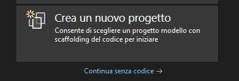
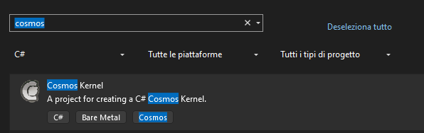

# Creating a project

## Windows

To create a Cosmos project, open Visual stuio 2022 and press **Create a new project**

Then Search and select "Cosmos Kernel".

Click **next**, give the project a name (int this tutorial series we will use "LearnCosm3D") and click **create**

## Linux
